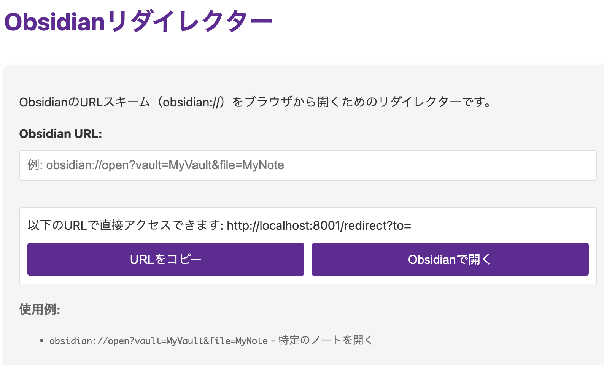

# Obsidian リダイレクター

## 概要

ローカルにある Obsidian を開くためのリダイレクタです。
Web アプリとして動作して、リンクの作成とリダイレクトを行います。
Obsidian の URL スキーム（obsidian://）が対応していない環境で Obsidian へのリンクを使いたい場合に利用可能です。



## 機能

- Obsidian URL を入力するためのシンプルなフォーム
- URL のコピー機能

## 使用方法

### サーバーの起動

```bash
# 通常起動
deno run --allow-net --allow-read src/main.ts

# 開発モード（ホットリロード）
deno run --watch --allow-net --allow-read src/main.ts
```

### 使用例

1. ブラウザで http://localhost:8001 にアクセス
2. フォームに Obsidian の URL を入力（例:
   obsidian://open?vault=MyVault&file=MyNote）
3. 「開く」ボタンをクリックすると、Obsidian アプリが開く
4. または「コピー」ボタンでリダイレクト URL をクリップボードにコピー

### API の使用

直接リダイレクト用の URL を使用:

```
http://localhost:8001/redirect?to=obsidian%3A%2F%2Fopen%3Fvault%3DMyVault%26file%3DMyNote
```

## 技術スタック

- Deno 2.1.5
- TypeScript
- HTML/CSS/JavaScript (フロントエンド)

## 開発

詳細な開発情報は [CLAUDE.md](./CLAUDE.md) を参照してください。
